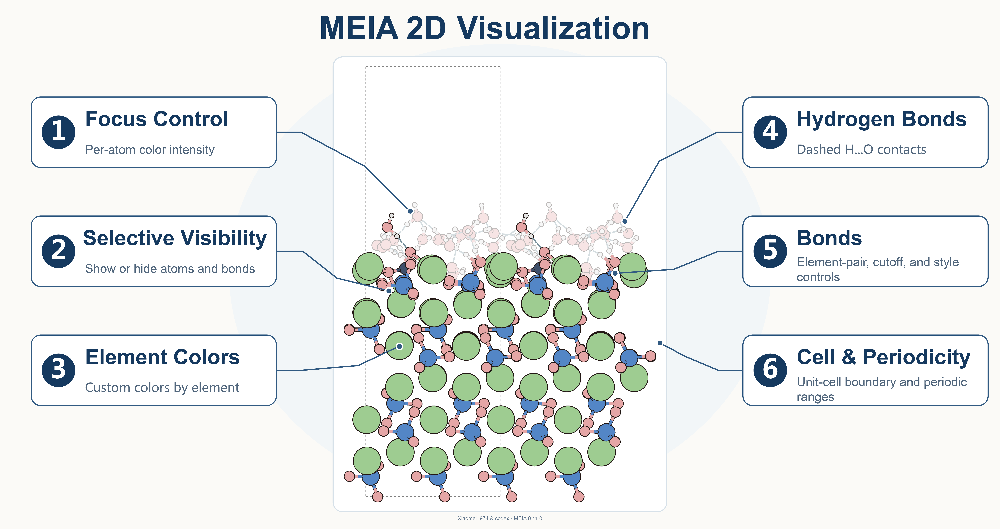

[中文](README.md) | [English](README.en.md)

# MEIA

**Molecular and Extended-system Illustration Assistant**

Xiaomei_974 & codex

MEIA is an atomistic-structure visualization application for interactive inspection and publication-oriented 2D illustration. It uses ASE for structure I/O and Streamlit, Plotly, and Matplotlib for interaction, rendering, and export.

> MEIA is under active development. It does not replace professional atomistic modelling software or guarantee physical correctness.

[](docs/images/readme/MEIA-feature-overview.en.svg)

## Features

- Switch between Simplified Chinese and English; the choice is stored locally in the browser.
- Read POSCAR/CONTCAR, CIF, XYZ, LAMMPS data, and other formats supported by ASE.
- Rotate, pan, zoom, and select atoms in 3D, then hide or show certain atoms or chemical bonds.
- Use covalent- or uniform-radius profiles and configure colours, bonds, hydrogen bonds, the unit cell, and periodic replicas.
- Generate large-system 2D previews on demand, with paged atom selection and interaction-only layer simplification.
- Import and export style presets and workspace snapshots, or batch-render multiple structures.
- Export SVG, PNG, and PDF; SVG preserves editable groups.

## Download the project without Git

1. On the GitHub repository page, click the green **Code** button and select **Download ZIP**.
2. Extract the archive; the project folder is normally named `MEIA-main`.
3. Open that folder in a terminal (Anaconda Prompt on Windows) and confirm that it contains `app.py` and `requirements.txt`.

## Requirements

- Python 3.10 (verified with 3.10.19).
- Python dependencies listed in [`requirements.txt`](requirements.txt).
- Node.js is not required for normal use; rebuilding the 3D frontend requires Node.js 18+ and npm.

## First-time environment setup

### If Conda is not installed

Install the version of **Miniconda** for your operating system using the [official guide](https://docs.conda.io/miniconda.html). On macOS, choose Apple Silicon (`arm64`) or Intel (`x86_64`) as appropriate. Reopen the terminal after installation and verify:

```bash
conda --version
```

A version number confirms that Conda is available.

### Create an isolated MEIA environment

Run from the project root:

```bash
conda create -n meia_env python=3.10 -y
conda activate meia_env
python -m pip install --upgrade pip
python -m pip install -r requirements.txt
```

This creates the `meia_env` environment and installs MEIA's dependencies. If a suitable Python 3.10 environment already exists, activate it and run `python -m pip install -r requirements.txt` instead.

## Start MEIA

From the project root, run:

```bash
conda activate meia_env
python -m streamlit run app.py
```

Streamlit normally opens a browser automatically; otherwise visit [http://localhost:8501](http://localhost:8501). Press `Ctrl+C` to stop the application.

Complete walkthroughs from importing the example `CONTCAR` to exporting SVG and a workspace snapshot:

- [English Tutorial](docs/TUTORIAL.en.md)
- [中文教程](docs/TUTORIAL.zh-CN.md)

Tutorial images use repository-relative paths and are checked automatically. If GitHub shows only image placeholders, the current network is usually unable to reach GitHub's raw-image domain; download the ZIP and open the files under `docs/images/` locally.

Batch-rendering options:

```bash
python -m meia.batch --help
```

## Large-system behaviour

- Small structures still receive an automatic 2D preview. Above the complexity threshold, use **Generate/Update 2D Preview**. A stale preview remains visible for comparison but cannot be downloaded as the current image.
- Final 2D rendering and every SVG/PNG/PDF export always use the complete data; MEIA does not label a downsampled result as final.
- At 1,000 source atoms, the sidebar switches to 200-atom pages. 3D click/box selection, index ranges, and element selection remain available.
- At 20,000 displayed atom instances, bond outlines and hydrogen bonds are hidden only during rotation or zoom and restored after interaction. Periodic expansion has a 50,000-instance safety cap.

Developers can run `python -m meia.benchmark_large_system --help` to generate a deterministic slab-and-water workload locally and execute the performance benchmark. The repository no longer ships a large structure or workspace snapshot.

## Optional: develop the 3D frontend

After changing the interactive 3D component, run:

```bash
cd meia/components/atom_viewer/frontend
npm ci
npm test
npm run build
```

## Verification

For routine changes, start with the fast checks:

```bash
python -m pytest -W error::FutureWarning --strict-markers -q -m "not release"
```

Before a release, run the complete checks, including reference-artifact
regeneration and repository-integrity tests:

```bash
python -m compileall -q app.py meia tests
python -m pytest -W error::FutureWarning --strict-markers -q
```

See [`docs/SPEC.md`](docs/SPEC.md) for requirements and [`docs/PROGRESS.md`](docs/PROGRESS.md) for development status.

## License and commercial use

MEIA is source-available software provided under the [PolyForm Noncommercial License 1.0.0](LICENSE.md):

- Personal study, hobby projects, and research or experimentation without an anticipated commercial application are free under the license.
- Charitable organizations, educational institutions, public research organizations, public safety or health organizations, environmental protection organizations, and government institutions may use MEIA under the license regardless of their funding source.
- Any business-related use by a company, sole proprietor, or other commercial organization, including internal research, requires a separate written commercial license. See [`license/COMMERCIAL.md`](license/COMMERCIAL.md).

Third-party dependencies and bundled frontend code remain under their respective licenses; see [`license/THIRD_PARTY_NOTICES.md`](license/THIRD_PARTY_NOTICES.md).

See [`CONTRIBUTING.md`](CONTRIBUTING.md) for bug reports and feature requests, and use the private process in [`SECURITY.md`](SECURITY.md) for vulnerabilities. Unsolicited code pull requests are not currently accepted.

Copyright 2026 Xiaomei_974
