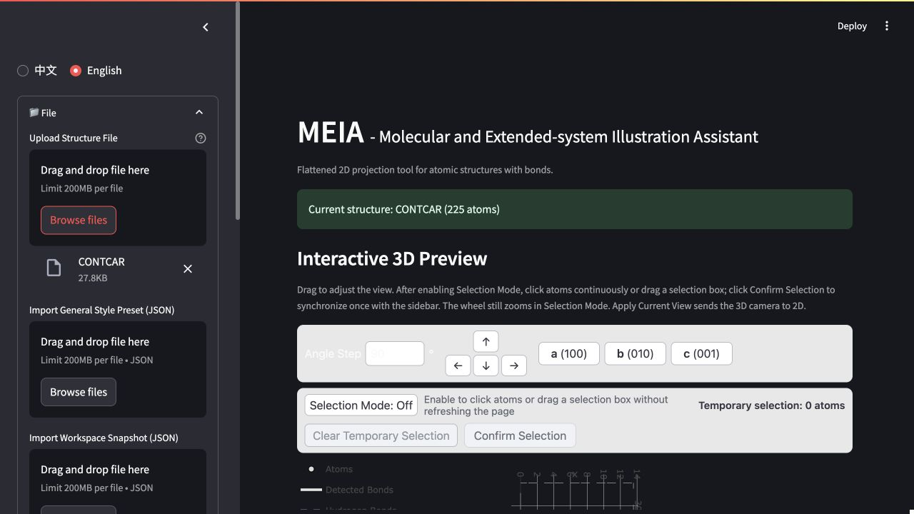
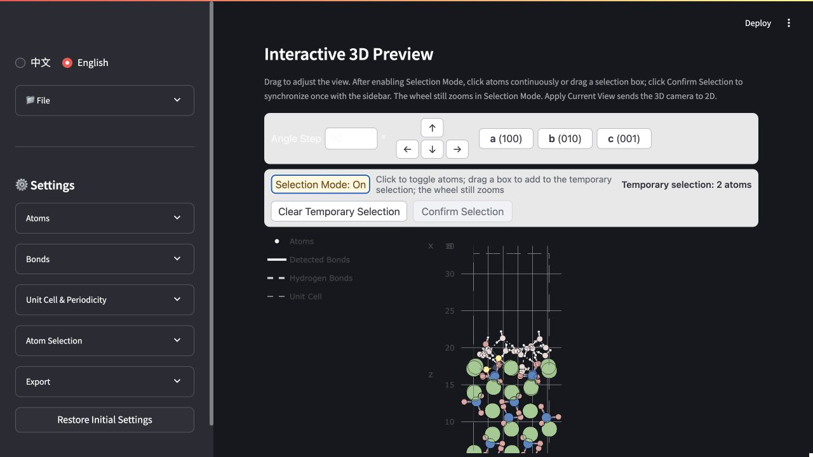
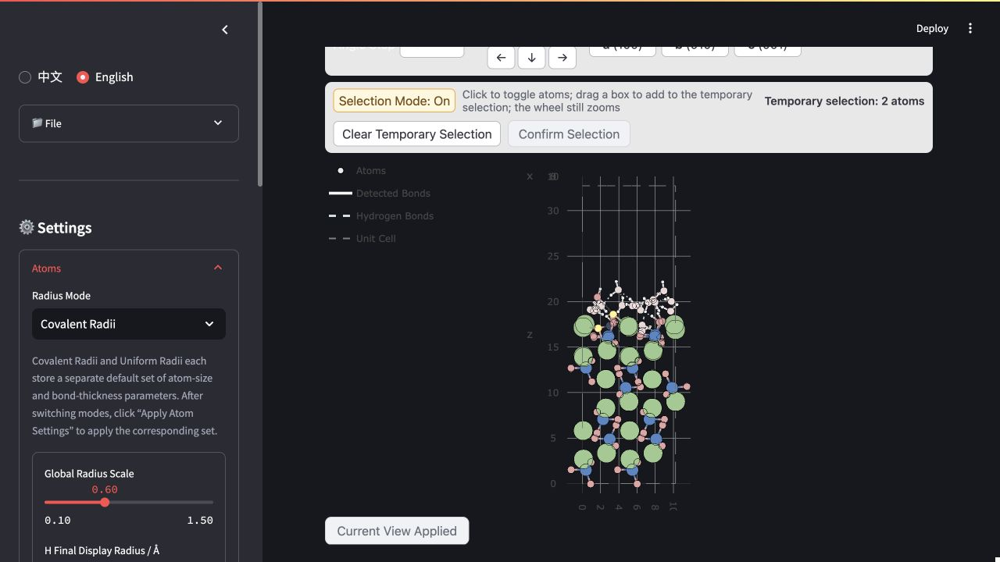
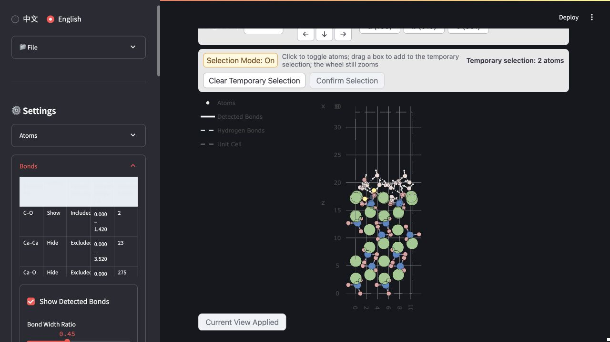
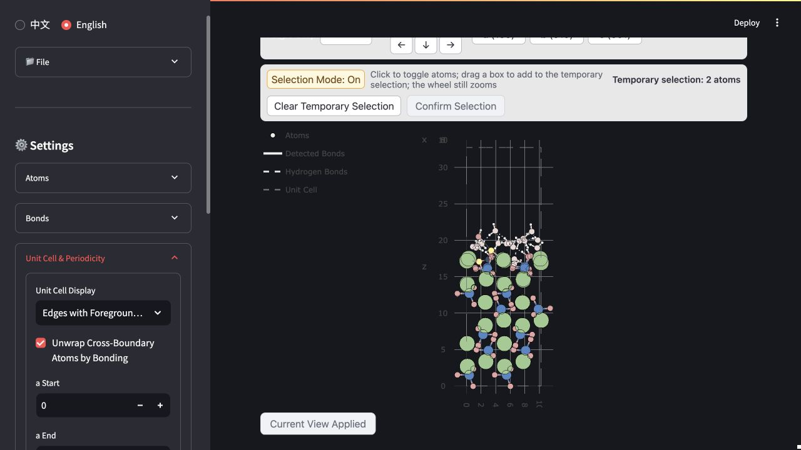
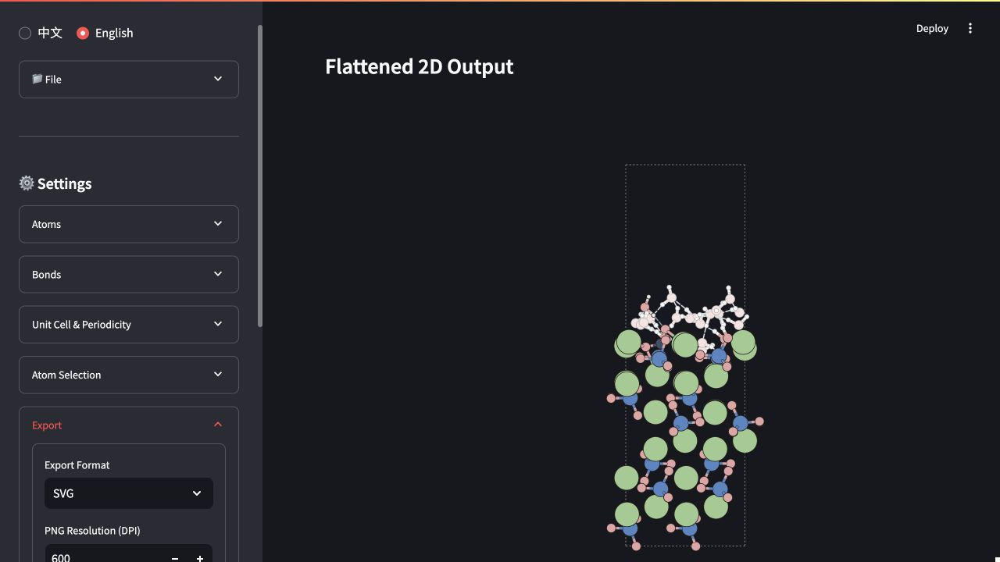

# MEIA Tutorial: From CONTCAR to SVG and a Workspace Snapshot

Xiaomei_974 & codex

This tutorial uses the 225-atom example included in the repository to walk through structure import, interactive 3D inspection, 2D view synchronization, atom and bond styling, periodic boundaries, atom selection, SVG export, and workspace-state preservation.

> Tutorial images use repository-relative paths. If GitHub shows only image placeholders, the current network is usually unable to reach GitHub's raw-image domain; download the repository ZIP and open the files under `docs/images/tutorial-en/` locally.

The example contains H, C, O, Si, and Ca, with the formula `CH36Ca48O116Si24`, and has periodic boundary conditions enabled along all three lattice directions. The workflow applies to systems containing other elements as well. The example settings are a reproducible starting point, not a universally valid physical model for every system.

## 1. Set Up and Start MEIA

From the project root, create an environment and install the dependencies:

```bash
conda create -n meia_env python=3.10 -y
conda activate meia_env
python -m pip install --upgrade pip
python -m pip install -r requirements.txt
```

Start MEIA:

```bash
conda activate meia_env
python -m streamlit run app.py
```

Your browser normally opens automatically. If it does not, visit `http://localhost:8501`. The language control at the upper left switches between “中文” and “English” in one click. A manual language choice is saved in the current browser.

This tutorial uses the following example files:

| File | Purpose |
| --- | --- |
| [`examples/CONTCAR`](../examples/CONTCAR) | Original 225-atom periodic structure |
| [`examples/meia-visual-state.workspace.meia.json`](../examples/meia-visual-state.workspace.meia.json) | Reference workspace state containing the structure, view, global style, selection, and per-atom settings |
| [`examples/CONTCAR_meia.svg`](../examples/CONTCAR_meia.svg) | An intermediate reference output for the same example |
| [`examples/CONTCAR_meia-2.svg`](../examples/CONTCAR_meia-2.svg) | Reference SVG matching the example workspace state; a browser may append `-2` when the same filename is downloaded again |

## 2. Import a Structure

1. Expand “📁 Files” in the sidebar.
2. Under “Upload Structure File,” select `examples/CONTCAR`.
3. Wait for “Current structure: CONTCAR (225 atoms)” to appear.
4. Confirm that both the 3D view and the 2D preview are visible. If reading fails, check that the filename, format, and contents are supported by the installed ASE version.



The Files section also contains two JSON import fields with different purposes:

- “Import General Style Preset (JSON)” applies only reusable styling to the current structure. Use it to keep atom, bond, unit-cell, view, and export styles consistent across structures.
- “Import Workspace Snapshot (JSON)” restores the coordinates, general style, selection, and per-atom overrides stored in the snapshot. You must first select “I confirm replacing the currently imported structure.” The action replaces only MEIA's in-memory structure and never modifies the original file on disk.

To open the completed reference state used in this tutorial, load `examples/meia-visual-state.workspace.meia.json` under “Import Workspace Snapshot (JSON),” select the confirmation checkbox, and click “Import Workspace Snapshot.”

## 3. Understand the 3D–2D Relationship

The interactive 3D preview appears in the upper part of the main page. The flattened 2D result used for export appears below it.

- Drag inside the 3D view to rotate the camera.
- Use a mouse wheel or a two-finger trackpad gesture to zoom. Zooming remains available while Selection Mode is on.
- `a (100)`, `b (010)`, and `c (001)` provide preset views along the lattice axes.
- The four arrow buttons rotate the view in screen directions. “Angle Step” controls the rotation applied by each click.
- Click “Apply Current View” to transfer the 3D camera direction to the 2D projection.

Zoom and pan in 3D are primarily inspection tools. “Apply Current View” synchronizes the viewing direction. The 2D canvas margins, dimensions, and final scale are controlled by the 2D renderer and export settings.

## 4. Select Atoms in 3D

1. Click “Selection Mode: Off” so that it changes to “Selection Mode: On.”
2. Click an atom to add it to, or remove it from, the temporary selection.
3. Press and drag across empty canvas space to draw a selection box. Atoms inside the box are added to the temporary selection.
4. Continue using the wheel or trackpad to zoom while selecting; zooming does not rotate the view.
5. Click “Clear Temporary Selection” if you want to start again.
6. Click “Confirm Selection” when the temporary set is correct. Only then is the selection synchronized to the sidebar in one update.



Temporary selection prevents a full-page refresh after every atom click. Yellow highlighting indicates the current selection without adding a fixed-size outer selection ring.

## 5. Set Atom Size, Outline, and Color

Expand “Atoms” in the sidebar. MEIA stores two independent profiles for atom size and bond thickness:

- “Covalent Radii”: the default mode, based on element covalent radii. It preserves relative size differences between elements.
- “Uniform Radii”: all elements without an explicit override use the same base radius. This mode is useful for more abstract or visually regular structure illustrations.

After switching modes, click “Apply Atom Settings” to apply the complete parameter set associated with that mode. Both profiles are stored together in one General Style Preset JSON.



A practical adjustment order is:

1. Select the radius mode.
2. Use “Global Radius Scale” to enlarge or reduce all atoms together.
3. If needed, directly change each element's final displayed radius in angstroms. This is the final absolute radius, so you do not need to calculate a multiplier yourself.
4. Adjust “Outline Width” and the element colors.
5. Click “Apply Atom Settings.”

If you first edit absolute element radii and then change the global scale, MEIA preserves their current proportions and scales them together. The reference workspace uses Covalent Radii with a global scale of `0.60` and an atom outline width of `0.50`. The Uniform Radii profile is stored in the same snapshot with a base radius of `0.35 Å` and a global scale of `1.00`.

“Restore Default Element Colors” changes only the element colors. “Restore Initial Settings,” located at the bottom of the sidebar, restores the atom, bond, unit-cell, and periodicity settings and clears the current atom selection. Its baseline is the most recently applied General Style Preset; if no preset has been imported, the built-in default style is used. The current camera and export settings are outside this reset scope.

## 6. Configure Regular Bonds and Hydrogen Bonds

Expand “Bonds.” The table at the top lists only element pairs actually detected in the current structure. It does not generate every possible combination of the elements present. The reference workspace for this example detects:

| Element Pair | Detected Bonds | Reference State |
| --- | ---: | --- |
| C–O | 2 | Visible; included in periodic unwrapping |
| Ca–Ca | 23 | Hidden by default; excluded from periodic unwrapping |
| Ca–O | 275 | Hidden by default; excluded from periodic unwrapping |
| H–O | 35 | Visible; included in periodic unwrapping |
| O–Si | 96 | Visible; included in periodic unwrapping |



Each element pair has two independent controls:

- “Show”: determines whether regular bonds for that pair are drawn.
- “Use for periodic unwrapping”: determines whether that pair contributes to bonded-component placement across unit-cell boundaries.

When MEIA automatically creates a rule for an element pair, it checks the shortest actually detected distance for that pair in the current structure. If the shortest distance is greater than `2.0 Å`, the pair is still detected, but it is hidden and excluded from periodic unwrapping by default. You can enable either option manually. The `2.0 Å` threshold is a display policy that reduces interference from long-range connections; it is not a physical criterion for covalent, ionic, or metallic bonding, nor is it a bond-strength definition. Rules explicitly stored in JSON are not reclassified.

“Add This Element Pair” creates an explicit rule for any combination of elements in the current structure. Set the minimum and maximum distances, visibility, and periodic-unwrapping state, then click “Apply Bond Settings.”

The common regular-bond style controls bond width, outline width, and outline color. The reference workspace uses a bond-width ratio of `0.45`, an outline color of `#231815`, and an outline width of `0.25`.

Hydrogen bonds are configured separately in the same section. The current rule recognizes only O–H···O geometries satisfying both conditions:

- H···O distance no greater than `2.5 Å`;
- O–H···O angle no smaller than `120°`;
- no O···O-distance proxy or other element-pair substitute is used.

Qualifying hydrogen bonds are drawn as dashed lines. The reference workspace contains 21 detected hydrogen bonds. Hydrogen bonds are not subject to the `2.0 Å` default classification and can be displayed or configured independently.

## 7. Unwrap Periodic Boundaries and Set Repetition Ranges

Expand “Unit Cell & Periodicity.”



Configure bond element pairs before adjusting periodic display:

1. Choose a unit-cell display mode: “Hidden,” “Edges Only,” or “Edges with Foreground Layering.”
2. Keep “Unwrap Cross-Boundary Atoms by Bonding” enabled so that connected Si–O and H–O groups are placed together where possible, instead of splitting a water molecule into OH and an isolated H.
3. Enter start and end values for a, b, and c. Each range is left-closed and right-open, `[start, end)`. The default `0` to `1` displays one period.
4. Check “Current periods” and “Estimated displayed atom instances” to ensure you have not created too many replicas unintentionally.
5. Click “Apply Unit Cell & Periodicity Settings.”

For example, setting the a range from `-1` to `2` displays three periods along a. When multiple periods are displayed, only the primary `0–1` interval draws the unit cell; replicated periods do not repeat the cell edges.

If MEIA reports a periodic-unwrapping conflict, inspect the element pairs listed in the warning and then adjust “Use for periodic unwrapping” for those pairs under Bonds. Conflicting groups are conservatively kept in place. MEIA does not arbitrarily alter the original coordinates to suppress a warning.

## 8. Select and Modify Specific Atoms from the Sidebar

After clicking “Confirm Selection” in 3D, expand “Atom Selection.” You can also build the selection directly in the sidebar:

- “Current Selection (Searchable)”: search by element symbol and atom number.
- “Add by Atom Number”: accepts expressions such as `1-10, 15, 42-47`; displayed atom numbers start at 1.
- “Add by Element”: adds all atoms of one element at once.
- “Invert Final Selection”: inverts the combined final selection.
- “Clear Selection”: clears the final selection.

The following operations can be explicitly enabled for the final selection:

- assign a per-atom color or restore the inherited element color;
- set an absolute color strength;
- hide selected atoms or restore their visibility;
- choose “No Change,” “Inherit Global Setting,” “Force Show,” or “Force Hide” for each detected regular-bond element pair;
- apply the same override choices to hydrogen bonds.

An operation changes the structure only when its corresponding “Change…” control is enabled. Finish by clicking “Apply Atom Operations.” The reference workspace selects O #47 and O #48 in the interface and forces their Ca–O connections to be shown. This preserves a small number of locally emphasized Ca–O links while Ca–O is hidden globally.

## 9. Inspect the 2D Result and Export SVG

After changing global styling, per-atom settings, or periodic ranges, inspect “Flattened 2D Output” on the main page. If you changed the 3D viewing direction, click “Apply Current View” first.

Expand “Export” in the sidebar:

1. Set “Export Format” to `SVG`.
2. SVG does not depend on DPI. “PNG Resolution (DPI)” affects only PNG export.
3. Choose whether to use a transparent background for your intended layout.
4. Click “Apply Export Settings.”
5. Enter a working name under “Export Name,” for example `meia-visual-state`.
6. Click “Download SVG.” This example normally produces `CONTCAR_meia.svg`; downloading the same name again may cause the browser to rename it `CONTCAR_meia-2.svg`.



SVG is a vector format suitable for continued editing in Illustrator, Inkscape, and similar applications. MEIA preserves editable atom and two-color bond groups where possible. Always inspect fonts, opacity, line widths, and final page composition after export.

## 10. Download and Re-import a Workspace Snapshot

The Export section contains two JSON download buttons:

- “Download General Style Preset” creates `<export-name>.style.meia.json`. It excludes structure coordinates and per-atom overrides and is intended for reusing a consistent style.
- “Download Workspace Snapshot” creates `<export-name>.workspace.meia.json`. It contains the in-memory structure, camera direction, both radius profiles, regular-bond and hydrogen-bond settings, periodic ranges, selection, and per-atom overrides.

It is good practice to download a Workspace Snapshot immediately after completing the SVG. To restore it in a new MEIA session:

1. Expand “📁 Files.”
2. Load the `.workspace.meia.json` file under “Import Workspace Snapshot (JSON).”
3. Check the reported source filename and atom count.
4. Select “I confirm replacing the currently imported structure.”
5. Click “Import Workspace Snapshot.”
6. Recheck the 3D view, 2D preview, atom selection, and export settings.

## 11. Final Checklist

Before exporting a production illustration, verify that:

- the current structure filename, atom count, and element composition are correct;
- 3D dragging, clicking, box selection, and zooming behave correctly, and selecting atoms does not change the view;
- “Apply Current View” has been clicked and the 2D orientation is correct;
- the intended atom-radius profile and its associated bond-width parameters have been applied;
- regular-bond element pairs show only the connections you need, and the defaults for long-distance pairs have been reviewed manually;
- the H···O distance and O–H···O angle thresholds match the purpose of the illustration;
- cross-boundary molecules and groups are not split incorrectly, and no periodic-unwrapping warning remains unreviewed;
- atom visibility, color strength, and local regular-bond or hydrogen-bond overrides are correct;
- the background transparency, export format, and filename are correct;
- the SVG and a Workspace Snapshot have both been downloaded.

## 12. Troubleshooting

### I rotated the 3D view, but the 2D output did not change

Click “Apply Current View” below the 3D viewer. Dragging the 3D view alone does not overwrite the 2D projection direction.

### I cannot zoom while Selection Mode is on

Place the pointer inside the 3D canvas and use a mouse wheel or a two-finger trackpad gesture. While Selection Mode is on, clicking and dragging a box select atoms, and the wheel remains dedicated to zooming.

### A water molecule is split across opposite sides of the cell

Confirm that H–O is included in periodic unwrapping and that “Unwrap Cross-Boundary Atoms by Bonding” is enabled under Unit Cell & Periodicity. If a conflict warning appears, review the listed element pairs individually instead of enabling every long-range connection.

### Why are Ca–O or Ca–Ca connections detected but not visible?

MEIA preserves the detected matches, but element pairs whose shortest detected distance is greater than `2.0 Å` are hidden and excluded from periodic unwrapping by default. This is only an initial display policy. You can enable a pair globally under Bonds or force only selected atoms' connections to be shown under Atom Selection.

### The atoms are too large and hide the bonds in water

Under Atoms, reduce the global scale for the active radius profile or directly reduce the final displayed radii of H and O. If necessary, adjust the bond-width ratio stored in the same profile. Click the relevant Apply button after every edit.

### I want to apply the same style to another structure

Download and import a General Style Preset. Use a Workspace Snapshot instead if you also need to restore the coordinates, selection, and per-atom overrides.
