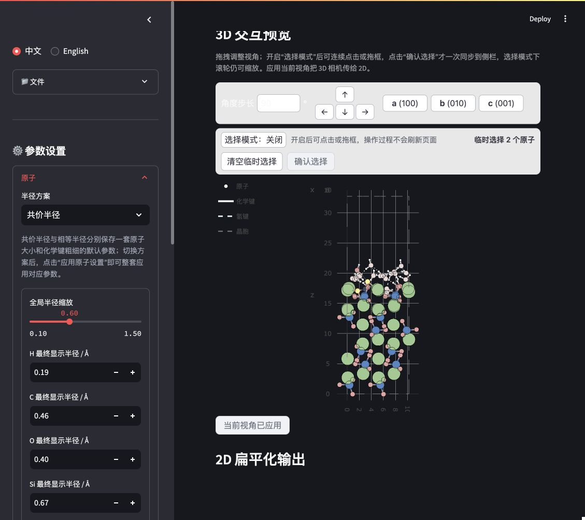
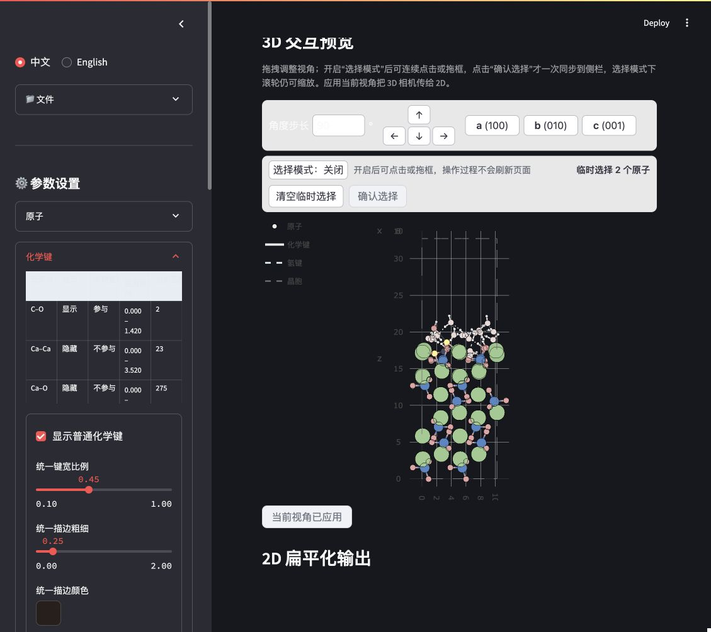
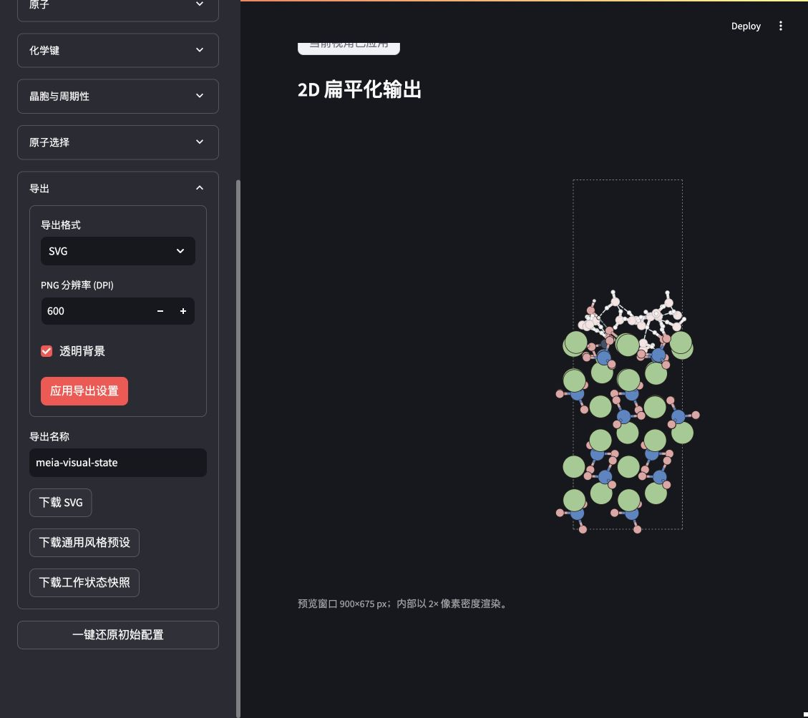

# MEIA 中文教程：从 CONTCAR 到 SVG 与工作状态快照

Xiaomei_974 & codex

本教程以仓库中的 225 原子案例为例，完整演示构型导入、3D 交互检查、2D 视角同步、原子与化学键样式、周期性边界、原子选择、SVG 导出和工作状态保存。

> 教程图片使用仓库相对路径。如果 GitHub 页面只显示图片占位符，通常是当前网络无法访问 GitHub 的原始图片域名；可下载仓库 ZIP 后直接打开 `docs/images/tutorial/` 中的图片。

示例体系包含 H、C、O、Si、Ca 五种元素，化学式为 `CH36Ca48O116Si24`，三个晶轴方向均启用周期性边界条件。教程中的规则同样适用于其他元素体系；示例参数只是一个可复现的起点，不代表对所有体系都具有物理普适性。

## 1. 准备与启动

在项目根目录中创建环境并安装依赖：

```bash
conda create -n meia_env python=3.10 -y
conda activate meia_env
python -m pip install --upgrade pip
python -m pip install -r requirements.txt
```

启动 MEIA：

```bash
conda activate meia_env
python -m streamlit run app.py
```

浏览器通常会自动打开；若没有，请访问 `http://localhost:8501`。页面左上角可一键切换“中文”和“English”，手动选择的语言会保存在当前浏览器中。

本教程使用以下示例文件：

| 文件 | 用途 |
| --- | --- |
| [`examples/CONTCAR`](../examples/CONTCAR) | 原始 225 原子周期性构型 |
| [`examples/meia-visual-state.workspace.meia.json`](../examples/meia-visual-state.workspace.meia.json) | 包含构型、视角、全局样式和具体原子设置的参考工作状态 |
| [`examples/CONTCAR_meia.svg`](../examples/CONTCAR_meia.svg) | 同一案例的另一份过程参考输出 |
| [`examples/CONTCAR_meia-2.svg`](../examples/CONTCAR_meia-2.svg) | 与示例工作状态匹配的参考 SVG；浏览器重复下载同名文件时可能自动添加 `-2` |

## 2. 导入构型

1. 展开侧边栏的“📁 文件”。
2. 在“上传构型文件”中选择 `examples/CONTCAR`。
3. 等待页面显示“当前结构：CONTCAR（225 个原子）”。
4. 检查 3D 视图和 2D 预览是否都已出现。如果读取失败，先确认文件名、格式和内容能被当前 ASE 版本识别。


“文件”模块还有两个 JSON 入口，作用不同：

- “导入通用风格预设”只把通用样式应用到当前结构，适合让多个构型保持一致的原子、化学键、晶胞、视角和导出风格。
- “导入工作状态快照”会恢复快照内的结构坐标、通用样式、选择集合和具体原子覆盖规则。导入前必须勾选“我确认覆盖当前已导入结构”；它只替换 MEIA 当前内存中的结构，不修改磁盘原文件。

如果想直接查看本教程的参考完成状态，可把 `examples/meia-visual-state.workspace.meia.json` 放入“导入工作状态快照”，勾选确认项，再点击“确认导入工作状态快照”。

## 3. 认识 3D 与 2D 的关系

主页面上方是 3D 交互预览，下方是最终用于导出的 2D 扁平化结果。

- 在 3D 视图内拖拽可旋转视角。
- 使用滚轮或触控板双指滑动可缩放；选择模式开启时仍可缩放。
- `a (100)`、`b (010)`、`c (001)` 提供沿晶轴观察的预设方向。
- 四个箭头按照屏幕方向旋转视角，“角度步长”控制每次旋转的角度。
- 点击“应用当前视角”后，3D 相机方向才会传给 2D 投影。

3D 中的缩放和平移主要用于交互检查；“应用当前视角”同步的是观察方向。2D 画面的留白、尺寸和最终缩放由 2D 渲染与导出设置决定。

## 4. 在 3D 中选择原子

1. 点击“选择模式：关闭”，使其变为“选择模式：开启”。
2. 单击原子可加入或移出临时选择。
3. 在空白处按住并拖动可框选；框选会把命中的原子加入当前临时集合。
4. 选择过程中可继续用滚轮或触控板缩放，不会切换视角。
5. 点击“清空临时选择”可重新开始。
6. 确认无误后点击“确认选择”，选择集合才会一次同步到侧边栏。


临时选择的目的，是避免每点一个原子都触发整页刷新。黄色高亮只表示当前选择，不会额外添加固定大小的外圈选择框。

## 5. 设置原子大小、轮廓和颜色

展开“原子”模块。MEIA 保存两套独立的原子大小与化学键粗细参数：

- “共价半径”：默认方案，以元素共价半径为基准，适合保留不同元素的相对尺寸。
- “相等半径”：所有未单独覆盖的元素使用同一个基础半径，适合更抽象、规整的结构示意图。

切换方案后，必须点击“应用原子设置”，对应方案的整套参数才会生效。两套参数同时保存在同一个通用风格 JSON 中。



建议按以下顺序调整：

1. 先选择半径方案。
2. 用“全局半径缩放”整体放大或缩小全部原子。
3. 如有需要，直接修改每种元素的“最终显示半径 / Å”。该字段是最终绝对半径，不需要用户反算倍率。
4. 调整“轮廓粗细”和元素颜色。
5. 点击“应用原子设置”。

若先修改了元素绝对半径，再调整全局倍率，MEIA 会保持当前各元素半径之间的比例并共同缩放。参考工作状态使用共价半径方案、全局缩放 `0.60`、原子轮廓粗细 `0.50`；相等半径方案保存在同一个快照中，基础半径为 `0.35 Å`、全局缩放为 `1.00`。

“恢复默认元素配色”只恢复元素颜色；页面最下方的“一键还原初始配置”用于恢复原子、化学键、晶胞与周期性设置，并清空当前原子选择。还原基准是最近一次成功应用的通用风格预设；若没有导入过预设，则使用软件内置默认风格。当前视角和导出设置不在该按钮的还原范围内。

## 6. 设置普通化学键和氢键

展开“化学键”模块。顶部表格只列出当前构型实际匹配到的元素对，不会对体系内元素做全部排列组合。这个案例的参考工作状态匹配到：

| 元素对 | 匹配数 | 参考状态 |
| --- | ---: | --- |
| C–O | 2 | 显示，参与周期整理 |
| Ca–Ca | 23 | 默认隐藏，不参与周期整理 |
| Ca–O | 275 | 默认隐藏，不参与周期整理 |
| H–O | 35 | 显示，参与周期整理 |
| O–Si | 96 | 显示，参与周期整理 |



每个元素对有两项互相独立的开关：

- “显示”：决定是否绘制该元素对的普通化学键。
- “参与周期整理”：决定该元素对是否用于判断跨晶胞边界的成键连通组。

默认自动生成元素对规则时，MEIA 会检查该元素对在当前结构中的最短实际匹配距离。最短距离 `> 2.0 Å` 的元素对仍会被匹配，但默认不显示、也不参与周期整理；用户可以手动开启。`2.0 Å` 只是降低长距离连接对默认画面和 PBC 整理干扰的显示策略，不是共价键、离子键、金属键或化学键强弱的物理判据。JSON 中已经明确保存的规则不会被重新分类。

“新增该元素对”可为当前结构中的任意元素组合建立显式规则。设置最小/最大距离、显示和周期整理状态后，点击“应用化学键设置”。

普通化学键样式可统一调整键宽、描边粗细和描边颜色。参考工作状态使用键宽比例 `0.45`、黑褐色描边 `#231815`、描边粗细 `0.25`。

氢键在同一模块下单独设置。当前规则只识别几何条件满足的 O–H···O：

- H···O 距离不大于 `2.5 Å`；
- O–H···O 夹角不小于 `120°`；
- 不以 O···O 距离或其他元素对代替这一规则。

满足条件的氢键以虚线显示。参考工作状态中检测到 21 条氢键。氢键不参与上述 `2.0 Å` 默认分类，可独立开关和调参。

## 7. 整理周期性边界并设置重复范围

展开“晶胞与周期性”模块。


建议先完成化学键元素对设置，再处理周期性：

1. 选择晶胞显示方式：“隐藏”“仅边框”或“边框与前景层次”。
2. 保持“按成键关系整理跨边界原子”开启，使 Si–O、H–O 等连通组尽量显示在同一侧，避免水分子被拆成 OH 和孤立 H。
3. 分别填写 a、b、c 的起点和终点。范围采用左闭右开形式 `[起点, 终点)`；默认 `0` 到 `1` 表示显示一个周期。
4. 查看“当前周期数”和“预计显示原子实例数”，确认没有无意中生成过多副本。
5. 点击“应用晶胞与周期性设置”。

例如把 a 方向设置为 `-1` 到 `2`，就会显示三个 a 方向周期。多周期显示时，只有主区间 `0–1` 绘制晶胞，其他周期副本不重复画晶胞边框。

如果页面提示周期整理冲突，先查看警告中列出的元素对，再回到“化学键”模块调整其“参与周期整理”状态。冲突部分会保守保持原位，MEIA 不会为了消除警告而任意改变原始坐标。

## 8. 在侧边栏批量选择并修改具体原子

3D 中点击“确认选择”后，展开“原子选择”。也可以不使用 3D，直接通过侧边栏建立集合：

- “当前选择（可搜索）”：按元素符号和原子序号搜索。
- “按序号加入选择”：支持 `1-10, 15, 42-47`；界面使用从 1 开始的原子序号。
- “按元素加入选择”：一次加入某种元素的全部原子。
- “反选最终集合”：对合并后的选择取反。
- “清空选择”：清空最终集合。

对最终集合可以显式启用以下操作：

- 设置具体原子颜色，或恢复继承元素颜色；
- 设置绝对色彩强度；
- 隐藏所选原子或恢复显示；
- 对每个已匹配普通化学键元素对选择“不修改”“继承全局”“强制显示”或“强制隐藏”；
- 对氢键使用同样的覆盖规则。

只有勾选相应“修改……”选项后，该项才会改变。最后点击“应用原子操作”。参考工作状态选择了界面中的 O #47 和 O #48，并对它们的 Ca–O 连接使用“强制显示”，用于在全局隐藏 Ca–O 时保留局部需要强调的连接。

## 9. 检查 2D 结果并导出 SVG

每次修改全局样式、具体原子设置或周期范围后，都检查主页面下方的“2D 扁平化输出”。如果刚调整了 3D 观察方向，先点击“应用当前视角”。

展开“导出”模块：

1. 将“导出格式”设为 `SVG`。
2. SVG 不依赖 DPI；“PNG 分辨率”只在 PNG 导出时控制栅格分辨率。
3. 根据排版需要选择是否使用透明背景。
4. 点击“应用导出设置”。
5. 在“导出名称”中填写工作名称，例如 `meia-visual-state`。
6. 点击“下载 SVG”。本案例默认得到 `CONTCAR_meia.svg`；浏览器再次下载同名文件时可能自动重命名为 `CONTCAR_meia-2.svg`。



SVG 是矢量文件，适合在 Illustrator、Inkscape 等软件中继续编辑。MEIA 会尽量保留原子和双色化学键的可编辑分组；导出后仍建议检查字体、透明度、线宽和最终版面。

## 10. 下载并重新导入工作状态快照

在同一个“导出”模块中还有两个 JSON 下载按钮：

- “下载通用风格预设”生成 `<导出名称>.style.meia.json`，不包含构型坐标和具体原子覆盖，适合复用统一风格。
- “下载工作状态快照”生成 `<导出名称>.workspace.meia.json`，包含当前内存结构、视角、两套半径方案、普通化学键和氢键参数、晶胞周期范围、选择集合及具体原子覆盖。

推荐在完成 SVG 后立即下载一次工作状态快照。重新打开 MEIA 时：

1. 展开“📁 文件”。
2. 把 `.workspace.meia.json` 放入“导入工作状态快照”。
3. 核对提示中的源文件名和原子数。
4. 勾选“我确认覆盖当前已导入结构”。
5. 点击“确认导入工作状态快照”。
6. 再次检查 3D、2D、选择原子和导出设置。

## 11. 最终检查清单

导出正式图片前，建议逐项确认：

- 当前结构文件名、原子数和元素组成正确。
- 3D 拖拽、点选、框选和缩放行为正常；选择原子不会改变视角。
- 已点击“应用当前视角”，2D 方向符合预期。
- 原子半径方案和对应的键宽参数已经应用。
- 普通化学键元素对只显示需要的连接；长距离元素对的默认状态已人工复核。
- 氢键的 H···O 距离和 O–H···O 角度阈值符合当前制图目的。
- 跨周期分子和基团没有被不合理拆开；没有未处理的周期整理冲突警告。
- 隐藏原子、颜色强度及局部化学键/氢键覆盖符合预期。
- 透明背景、导出格式和文件名正确。
- SVG 已下载，同时保存了工作状态快照。

## 12. 常见问题

### 3D 已旋转，但 2D 没有变化

点击 3D 视图下方的“应用当前视角”。仅拖拽 3D 不会自动改写 2D 投影方向。

### 选择模式下无法缩放

把指针放在 3D 画布内，再使用滚轮或触控板双指滑动。选择模式开启时，单击/拖框用于选择，滚轮仍专门用于缩放。

### 水分子被拆到晶胞两侧

确认 H–O 元素对参与周期整理，并在“晶胞与周期性”中开启“按成键关系整理跨边界原子”。若出现冲突警告，按警告列出的元素对逐项检查，不要盲目开启所有长距离连接。

### Ca–O、Ca–Ca 等连接为什么被匹配却没有显示

MEIA 会保留匹配结果，但最短实际匹配距离大于 `2.0 Å` 的元素对默认不显示且不参与周期整理。这只是初始显示策略。可在“化学键”模块全局开启，也可在“原子选择”中只对特定原子强制显示。

### 原子太大，水分子的键被遮住

在“原子”模块减小当前半径方案的全局缩放，或直接减小 H、O 的最终显示半径；必要时再调整同一方案保存的键宽比例。每次修改后都点击对应模块的应用按钮。

### 想把相同风格用于另一个构型

下载并导入“通用风格预设”。如果需要连同当前坐标、选择集合和具体原子覆盖一起恢复，则使用“工作状态快照”。
